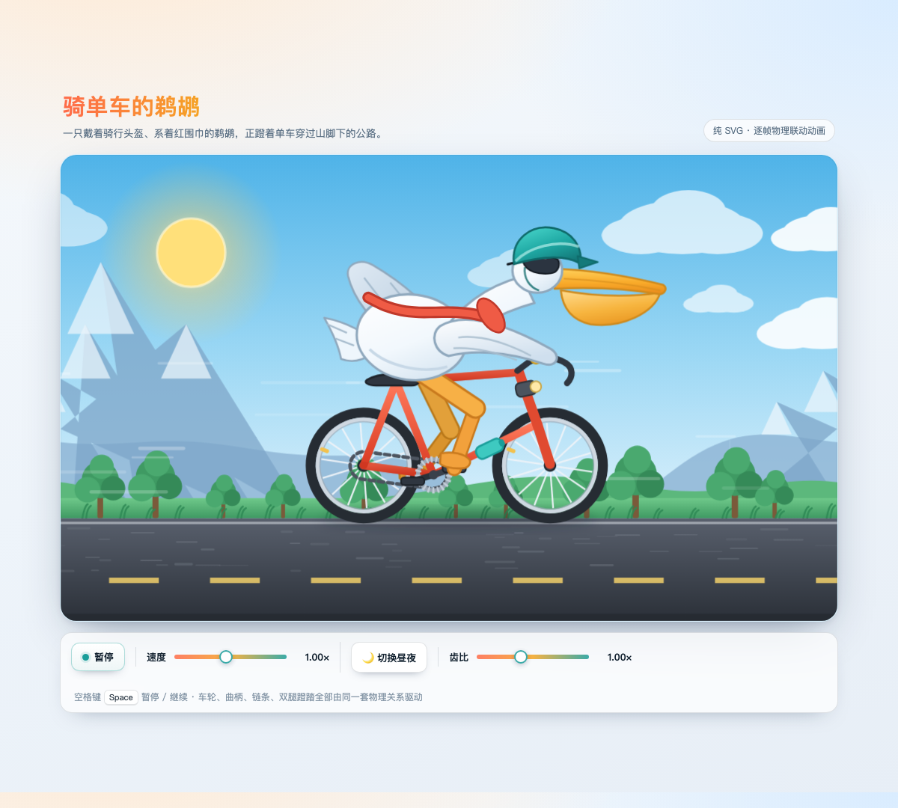
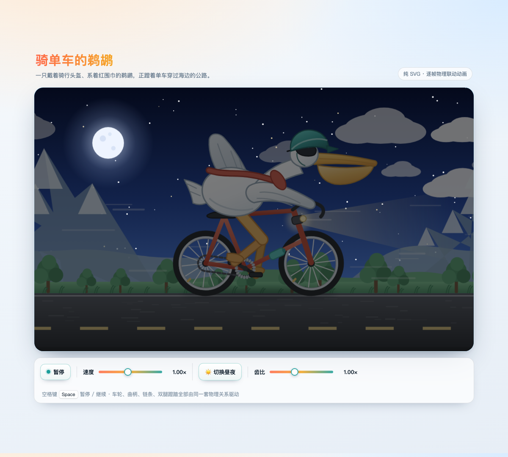

# 骑单车的鹈鹕 🚴

一个纯前端（单个 HTML 文件、零依赖、零构建）的逐帧动画：一只戴骑行头盔、系红围巾的鹈鹕，
蹬着单车穿过山脚下的公路。

打开方式：双击 `index.html`，或 `open index.html`（无需服务器）。




## 动画里有什么在动

| 元素 | 驱动方式 |
| --- | --- |
| 车轮（含辐条 / 气门嘴） | `ω = v / R`，与地面滚动严格同步 |
| 牙盘 · 飞轮 · 曲柄 · 脚踏 | `ω曲柄 = ω车轮 × r飞轮 / r牙盘`，脚踏永远保持水平 |
| 链条 | 虚线偏移动画，线速度 = `ω曲柄 × r牙盘`，与齿比一致 |
| 双腿蹬踏 | 两段式 IK 反解：髋 → 膝（始终朝前）→ 脚，脚掌永远踩在脚踏上 |
| 身体起伏 / 侧倾 / 点头 | 曲柄频率的 2 倍（每踏一圈左右腿各发力一次） |
| 围巾 | 每帧用正弦波重建 Catmull-Rom 曲线 |
| 尾羽 / 远侧翅膀 | 独立相位抖动与扇动 |
| 公路 · 路面纹理 | 与实际车速 1:1 滚动 |
| 草丛树林 / 远山 / 云 | 视差滚动（0.26× / 0.085× / 0.035×），周期性无缝平铺 |
| 昼夜 | 太阳↔月亮淡入淡出、星空点亮、车灯与光锥、整体压暗去饱和 |

所有元素共用同一个仿真时钟 `t`，因此速度调快调慢时，车轮、链条、踏频永远保持一致，不会「打滑」。

## 交互

- **暂停 / 播放**：按钮或 <kbd>空格</kbd>
- **速度**：0× ~ 2.2×（整体调速，物理关系不变）
- **齿比**：只改变踏频，不改变车速 —— 可以直接看出「换挡」的效果
- **昼夜**：白天 / 夜晚切换

URL 参数可直接进入某个状态，便于分享或录屏取帧：

```
index.html?t=2.4&speed=60&gear=120&night=1
```

- `t`：起始动画时间（秒）
- `speed`：0–220，对应 0–2.2×
- `gear`：70–150，对应 0.7×–1.5×
- `night`：`1` 进入夜晚

## 说明

- 全部图形由 SVG 手写路径 + 少量 JS 程序化生成（车轮辐条、星空、山脊、树丛、路面纹理），
  没有图片、字体等外部资源，断网也能跑。
- 山脊与树丛使用周期函数生成，平铺接缝无痕。
- 尊重 `prefers-reduced-motion`：系统开启「减弱动态效果」时默认暂停。
- 已适配窄屏，画布随宽度等比缩放。
